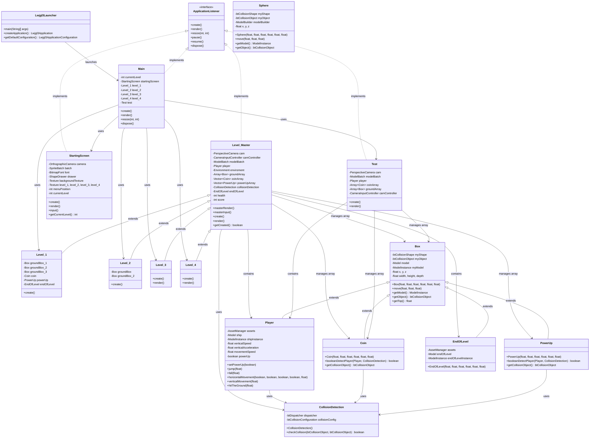
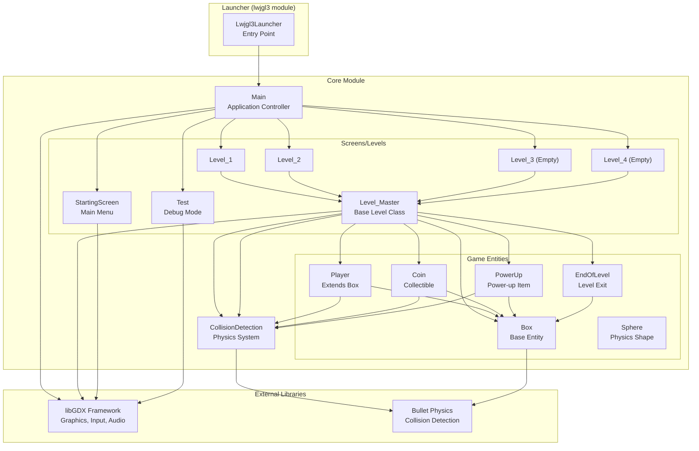
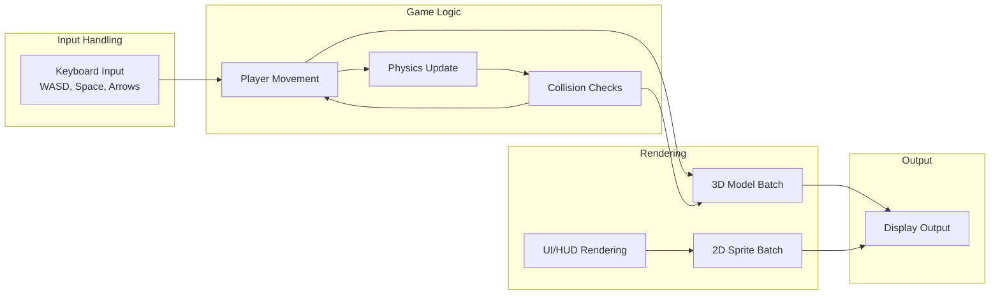

# fastRunner - Architecture Diagram

## Class Diagram



## Component Interaction Flow



## Data Flow Diagram



## Directory Structure

```
fastRunner/
├── core/                          # Main game logic (shared across platforms)
│   └── src/main/java/com/yourname/projectname/
│       ├── Main.java              # Application controller
│       ├── Test.java              # Debug/test mode
│       ├── CollisionDetection.java # Physics collision system
│       ├── entities/              # Game entities
│       │   ├── Box.java           # Base box-shaped entity
│       │   ├── Sphere.java        # Sphere physics helper
│       │   ├── Player.java        # Player character
│       │   ├── Coin.java          # Collectible coin
│       │   ├── PowerUp.java       # Power-up item
│       │   └── EndOfLevel.java    # Level exit marker
│       └── levels/                # Game levels
│           ├── Level_Master.java  # Base level class
│           ├── Level_1.java       # First level (complete)
│           ├── Level_2.java       # Second level
│           ├── Level_3.java       # Third level (empty)
│           ├── Level_4.java       # Fourth level (empty)
│           └── StartingScreen.java # Main menu screen
├── lwjgl3/                        # Desktop launcher (LWJGL3)
│   └── src/main/java/com/yourname/projectname/lwjgl3/
│       ├── Lwjgl3Launcher.java    # Main entry point
│       └── StartupHelper.java     # JVM startup helper
└── assets/                        # Game assets (textures, models, sounds)
```

## Key Interactions Summary

| Component | Interacts With | Purpose |
|-----------|---------------|---------|
| **Lwjgl3Launcher** | Main | Application entry point, configures window |
| **Main** | All Levels, StartingScreen, Test | Routes between screens/levels |
| **Level_Master** | Player, Entities, CollisionDetection | Core game loop, physics, rendering |
| **Level_1-4** | Level_Master | Specific level configurations |
| **Player** | Box, CollisionDetection | Player movement, physics, rendering |
| **Box** | Bullet Physics | Base collision shape for entities |
| **Coin/PowerUp** | Player, CollisionDetection | Detect player collection |
| **CollisionDetection** | Bullet Physics | Check collisions between objects |
| **StartingScreen** | libGDX UI | Menu navigation, level selection |

## Technology Stack

- **Game Framework**: libGDX
- **Physics Engine**: Bullet Physics (via gdx-bullet)
- **Build Tool**: Gradle
- **Language**: Java 8+
- **Platforms**: Desktop (LWJGL3)
